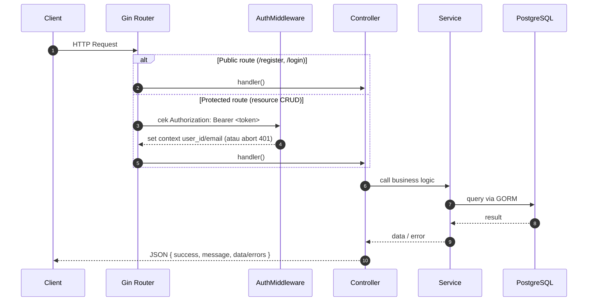

# Backend Architecture & Project Flow (Smart Expenses & Subscriptions Manager)

Dokumen ini merangkum **struktur folder** dan **alur request** pada backend Go (Gin + GORM + PostgreSQL) di workspace ini.

## 1) Gambaran Umum

- Framework HTTP: **Gin**
- ORM: **GORM**
- Database: **PostgreSQL**
- Auth: **JWT Bearer Token**
- Base path API: `/v1/api`

Entrypoint aplikasi ada di `main.go`:
- Load config dari environment (`config.Load()`)
- Inisialisasi koneksi Postgres + AutoMigrate (`db.InitPostgresDB(...)`)
- Setup Gin (logger, recovery, CORS)
- Daftarkan routing publik dan routing terproteksi (JWT middleware)

## 2) Struktur Folder & Tanggung Jawab

> Prinsip umum: **Routes → Controller → Service → Model(DB)**.

### `config/`
- `config.go`: load konfigurasi dari `.env`/environment variables.

### `models/`
- `user.go`, `category.go`, `expenses.go`, `subscription.go`, `notification.go`, `refresh_token.go`: definisi struktur data (GORM models).
- `config/`:
  - `postgres.go`: inisialisasi koneksi Postgres + `AutoMigrate` + setup enum types.
  - `database.go`: wrapper handler DB (saat ini minimal).
- `migrations/`: SQL migrations (up/down) untuk schema DB.

### `requests/`
- DTO request body untuk binding & validasi (Gin `ShouldBindJSON`).
- Contoh: `ExpenseRequest` menggunakan tag `binding:"required"`.

### `services/`
- Business logic dan akses DB via GORM.
- Mengembalikan error yang bisa dipetakan di controller (mis. `ErrForbidden`).

### `controllers/`
- HTTP handler: parse params, bind JSON, validasi, ambil `user_id` dari context, panggil service, dan format response.
- Menggunakan `utils.SuccessResponse` / `utils.ErrorResponse` untuk format response yang konsisten (sebagian endpoint masih return JSON manual).

### `routes/`
- Definisi route group per resource (expenses, categories, subscriptions).
- `routes/middleware/auth.go`: JWT middleware + helper rate limiting (rate limit belum dipakai di `main.go`).

### `utils/`
- `Response.go`: format response API.
- `Validator.go`: formatter error validasi (berdasarkan go-playground/validator).
- `Session.go`: helper membaca `user_id` dari Gin context (di-set oleh auth middleware).
- `Hash.go`: hashing & check password.

## 3) Alur Request (End-to-End)

### Diagram Umum



### Alur Login (Public)
1. `POST /v1/api/login`
2. Controller bind JSON ke `requests.UserLoginRequest`.
3. Service cari user by email.
4. Password dicek via `utils.CheckPasswordHash`.
5. Jika valid, controller buat JWT dengan claims:
   - `user_id`, `email`, `iat`, `exp`
6. Response mengembalikan token:

```json
{
  "success": true,
  "message": "Login success!",
  "data": {
    "token": "<jwt>",
    "expires_in": 3600,
    "type": "Bearer"
  }
}
```

### Alur Protected Route (contoh: Create Expense)
1. Client memanggil `POST /v1/api/expenses/` dengan header:
   - `Authorization: Bearer <jwt>`
2. `AuthMiddleware`:
   - parse token, validasi signature HMAC
   - cek `exp`
   - ambil `user_id` dan set ke Gin context (`ctx.Set("user_id", userId)`).
3. Controller:
   - bind body ke `requests.ExpenseRequest` + validasi
   - ambil `user_id` dari context dengan `utils.GetUserIdFromSession`
   - panggil `ExpenseService.Create(input, userId)`
4. Service:
   - buat `models.Expense` (userId dipaksakan dari session, bukan dari request)
   - insert via GORM.

## 4) Auth & Middleware

### JWT Middleware
- File: `routes/middleware/auth.go`
- Format header wajib: `Authorization: Bearer <token>`
- Jika invalid/expired: request di-`Abort()` dengan response error.

### Rate Limit (tersedia, belum dipakai)
- Ada `RateLimitMiddleware()` berbasis `golang.org/x/time/rate`.
- Untuk mengaktifkan global, bisa ditambahkan di `main.go` seperti `router.Use(middleware.RateLimitMiddleware())`.

## 5) Database & Schema

### Koneksi DB
- Init di `models/config/postgres.go` dengan DSN:
  - `host`, `port`, `user`, `password`, `dbname`, `sslmode=disable` (hard-coded disable di DSN saat ini)

### Enum Types
Sebelum `AutoMigrate`, app memastikan enum types berikut ada di PostgreSQL:
- `user_role`: `basic | premium | admin`
- `notification_type`: `email`
- `notification_status`: `pending | sent | failed`

### AutoMigrate
Aplikasi menjalankan `db.AutoMigrate()` untuk model:
- User, Category, Expense, Subscription, Notification, RefreshToken

### SQL Migrations
- SQL migration ada di `models/migrations/` (up/down).
- Catatan: target `make migrate-up` di `Makefile` saat ini mengarah ke `db/migrations` (folder itu belum ada di repo), jadi kemungkinan perlu penyesuaian path jika ingin memakai `migrate` CLI.

## 6) Konfigurasi Environment

Konfigurasi di-load oleh `config.Load()` dari `.env`/environment variables.

| Key | Default | Keterangan |
| --- | --- | --- |
| `SERVER_HOST` | `localhost` | host server |
| `SERVER_PORT` | `8080` | port server |
| `DB_HOST` | `localhost` | host postgres |
| `DB_PORT` | `5432` | port postgres |
| `DB_USER` | `postgres` | username |
| `DB_PASSWORD` | *(empty)* | password |
| `DB_NAME` | `smart_expense` | nama DB |
| `DB_SSLMODE` | `disable` | sslmode (belum dipakai di DSN init) |
| `JWT_SECRET` | `your-secure-secret-key` | secret HMAC |
| `ENV` | `development` | mode Gin (umumnya: `debug`/`release`/`test`) |
| `DATE_LAYOUT` | `2006-01-02 15:04:05` | format date layout |

Catatan:
- Di `main.go` ada `gin.SetMode(cfg.Env)`. Pastikan nilai `ENV` sesuai mode yang didukung Gin (mis. `debug` atau `release`) agar tidak error saat startup.

## 7) Menambah Fitur Baru (Checklist)

Misal menambah resource `Budgets`:
1. `models/budget.go` (schema + tags GORM)
2. `requests/BudgetRequest.go` (binding/validation)
3. `services/BudgetService.go` (query/logic)
4. `controllers/BudgetController.go` (HTTP handler)
5. `routes/routes.go` (tambah `BudgetRoutes(...)`)
6. `main.go` (init service + controller + register routes)

> Rekomendasi konsistensi: gunakan `utils.SuccessResponse/ErrorResponse` di semua endpoint supaya format response seragam.
